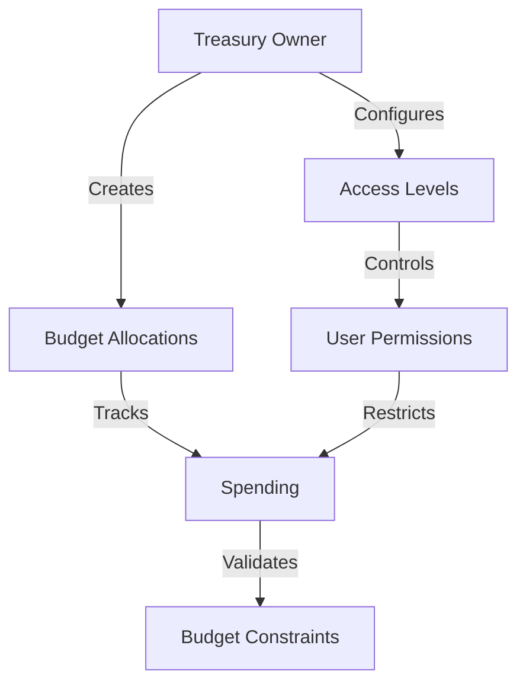

# HyperTreasury: Advanced Treasury Management

A secure, flexible treasury management system built on the Stacks blockchain, enabling sophisticated financial operations with robust access controls and comprehensive tracking.

## Overview

HyperTreasury provides a decentralized solution for managing organizational treasury funds with granular access control, budget tracking, and transparent allocation mechanisms. Key capabilities include:

- Multi-tier access control
- Fine-grained budget allocations
- Comprehensive spending tracking
- Immutable transaction records
- Flexible authorization levels

## Architecture



The system leverages two primary data structures:
- Treasury Allocations: Track budget details and spending
- User Access: Manage permission levels for treasury interactions

## Contract Documentation

### Core Components

#### Treasury Allocations
Stores detailed allocation information including:
- Allocation name and description
- Total budget
- Spent amount
- Access level requirements

#### User Access Levels
Defines three access tiers:
- Read: View-only access
- Write: Spending and allocation modification
- Admin: Full configuration rights

### Key Features

1. **Multi-Tier Access Control**
    - Granular permission management
    - Prevent unauthorized treasury interactions

2. **Dynamic Budget Tracking**
    - Real-time spending monitoring
    - Automatic budget constraint validation

3. **Immutable Transaction Logging**
    - Blockchain-based record keeping
    - Transparent and auditable treasury operations

## Getting Started

### Prerequisites
- Clarinet
- Stacks wallet
- STX tokens for transaction fees

### Basic Usage

1. Create a treasury allocation:
```clarity
(contract-call? .treasury-vault create-allocation 
    "Marketing Budget" 
    "Q3 Marketing Campaign Funding" 
    u50000 ;; Total budget
    u2)    ;; Write access level
```

2. Spend from an allocation:
```clarity
(contract-call? .treasury-vault spend-allocation 
    u0     ;; Allocation ID
    u10000 ;; Spend amount
)
```

3. Set user access level:
```clarity
(contract-call? .treasury-vault set-user-access 
    'ST1PQHQKV0RJXZFY1JB0 ;; User principal
    u2)                   ;; Write access level
```

## Function Reference

### Treasury Management

```clarity
(create-allocation 
    (name (string-ascii 50))
    (description (string-utf8 200))
    (budget uint)
    (access-level uint))

(spend-allocation 
    (allocation-id uint) 
    (amount uint))

(set-user-access 
    (user principal) 
    (access-level uint))
```

## Development

### Testing
1. Install Clarinet
2. Run tests:
```bash
clarinet test
```

### Local Development
1. Start Clarinet console:
```bash
clarinet console
```

2. Deploy contract:
```bash
clarinet deploy
```

## Security Considerations

### Key Security Measures
- Strict access level verification
- Budget constraint enforcement
- Immutable transaction records
- Granular permission management

### Best Practices
- Implement least-privilege access control
- Regularly audit treasury allocations
- Use admin access sparingly
- Validate all spending against budget constraints